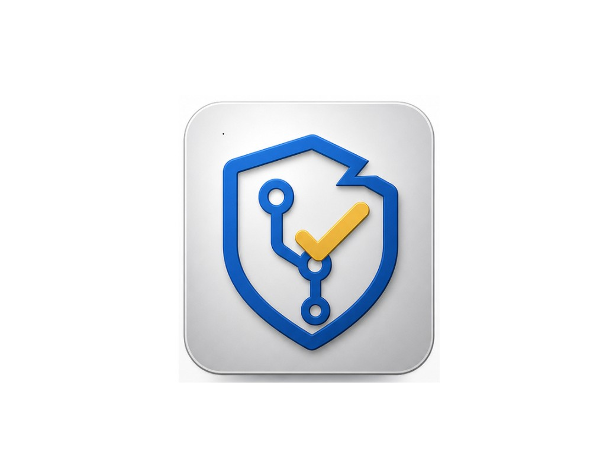

# Slay Check

<p align="center">
  
</p>

> **Slay Check** — AI-powered code review for GitHub Actions and local development

**TL;DR** — **Local (fastest):** `pip install` this repo → `slay-check setup` → `ollama pull llama3.2` → `slay-check quick`. **GitHub PRs:** copy a workflow from `examples/github-workflows/`, add your AI secret, open a PR → one review comment.

[](https://python.org)
[](LICENSE-AGPL)
[](https://github.com/prathameshap/slay-check/actions/workflows/ci.yml)
[](https://github.com/prathameshap/slay-check)
[](.github/workflows)

[](https://platform.openai.com)
[](https://www.anthropic.com)
[](https://ai.google.dev)
[](https://docs.perplexity.ai)
[](https://github.com/marketplace/models)
[](https://ollama.com)

**Slay Check** gives you a single, comprehensive AI review comment on every pull request. It supports multiple AI providers (OpenAI, Anthropic, Google Gemini, Perplexity, Ollama, GitHub Models, and Custom HTTP) with configurable criteria: problem analysis, algorithm review, complexity, and risk evaluation.

## Features

- **Multi-AI Support**: OpenAI, Anthropic, Google Gemini, Perplexity, Ollama (local/free), GitHub Models (free), Custom HTTP
- **Free local reviews**: Use Ollama (no API key, runs on your machine) or GitHub Models (free with your GitHub account)
- **GitHub Actions Ready**: Automated PR reviews
- **Single comment**: Full review (summary + per-file details) in one PR comment
- **CLI Interface**: Local development support
- **MCP server** (optional): `pip install "slay-check[mcp]"` — use `slay-check-mcp` with Claude Desktop, Cursor, and other MCP clients ([docs/mcp.md](docs/mcp.md))
- **Assistant skill packs**: [marketplace/](marketplace/) — Claude `SKILL.md` and ChatGPT Custom GPT instructions for publishing
- **Configurable Analysis**: Customize review criteria
- **Comprehensive Scoring**: Detailed feedback with actionable suggestions
- **Security Focused**: Built-in security and risk assessment

## Quick Start

### GitHub Actions (fastest path)

1. **Copy a workflow template** into your repo:
   - Copy one file from `examples/github-workflows/` → `.github/workflows/` in *your* repository.
2. **Add the required secret** for the template you chose (Settings → Secrets and variables → Actions).
3. **Open a PR** — Slay Check runs and posts **one** comment with the full review.

Slay Check is installed from this public repository, so you do **not** need to create a GitHub PAT just to use the workflow templates. GitHub Actions provides `GITHUB_TOKEN` automatically for PR metadata and review comments.

**Workflow templates (copy-paste)**:

| Workflow file | Provider | Secret required |
|---------------|----------|-----------------|
| `slay-check-anthropic.yml` | Anthropic (Claude) | `ANTHROPIC_API_KEY` |
| `slay-check-openai.yml` | OpenAI (GPT) | `OPENAI_API_KEY` |
| `slay-check-google.yml` | Google AI (Gemini) | `GOOGLE_AI_API_KEY` |
| `slay-check-perplexity.yml` | Perplexity AI | `PERPLEXITY_API_KEY` |
| `slay-check-custom-http.yml` | Custom HTTP endpoint | `SLAY_CHECK_AI_TOKEN` (optional) |

For more options (run from a fork, environment-specific or label-based workflows), see [docs/github-action.md](docs/github-action.md) and [examples/github-workflows/](examples/github-workflows/).

**Pip cache**  
Workflows use `cache: 'pip'` so dependencies are reused between runs. This shortens job time and does **not** increase GitHub Actions cost (you pay by runner minutes; caching typically reduces them).

**Where the review appears**  
Slay Check posts **one comment** per PR. By default it’s an **issue comment** (main conversation under "Conversation"). To use a **PR review** comment instead, set `use_issue_comments: false` in `slay-check.yaml`.

<details>
<summary><strong>Example review comment (click to expand)</strong></summary>

```
## Code Review Summary

**Overall Score:** 7.5/10

**Files Reviewed:** 3
**Issues Found:** 2

### Issues by Severity
- **Medium:** 1
- **Low:** 1

### Top Suggestions
- Consider using a constant for the retry limit
- Add input validation for the timeout parameter

---

### Per-file details

#### src/client.py (score: 7.0/10)

The HTTP client handles retries but does not validate timeout values.

**Issues:**
- **[medium]** performance (line 42): Unbounded retry loop may cause hangs
  - Suggestion: Add a max-retry constant and backoff strategy

**Suggestions:**
- Extract magic numbers into named constants
```

</details>

### Local — minimal effort

| Step | Command |
|------|---------|
| 1. Install | `pip install git+https://github.com/prathameshap/slay-check.git` |
| 2. One-line config (Ollama — **no API key**) | `slay-check setup` |
| 3. Pull a model once | `ollama pull llama3.2` |
| 4. Review your working tree | `slay-check quick` (same as `slay-check review --local`) |

Run **`slay-check`** with no arguments for a reminder. Use **`slay-check config init --quick`** for the same default YAML without prompts.

**PyPI:** not published yet — install from GitHub as above.

Copy [`.env.example`](.env.example) to `.env` if you prefer env vars over editing YAML.

**Alternatives (same idea, more manual):** set `SLAY_CHECK_AI_PROVIDER` yourself — see the table below. For **MCP** (Cursor / Claude Desktop), see [docs/mcp.md](docs/mcp.md).

| Method | Notes |
|--------|--------|
| **Ollama** | Free, offline — `slay-check setup` already sets `ai_provider: ollama` |
| **GitHub Models** | Free with a PAT — `slay-check setup --provider github` then set `SLAY_CHECK_AI_TOKEN` |

**From VS Code or Cursor** — run the same commands in the integrated terminal, or add MCP (`slay-check-mcp`) per [docs/mcp.md](docs/mcp.md). Optional: copy [`.env.example`](.env.example) → `.env`.

**Windows (PowerShell) for tokens:**

```powershell
$env:SLAY_CHECK_AI_TOKEN = "your-key"
slay-check quick
```

## Configuration

Create `slay-check.yaml` in your repository (or use environment variables).

### Minimal configuration (recommended)

Use a preset to keep it simple:

```yaml
# One of: full (default), standard, minimal, security, performance
review_preset: security
```

| Preset | What's reviewed |
|--------|------------------|
| `full` | Everything (problem, algorithm, best approaches, complexity, risk, security, performance) |
| `standard` | Same as full but skip problem analysis |
| `minimal` | Security + performance only |
| `security` | Security + risk only |
| `performance` | Algorithm, best approaches, complexity, performance |

**Or pick specific areas** with a list (only these are enabled):

```yaml
review_focus:
  - security
  - performance
  - complexity
```

Allowed focus names: `problem`, `algorithm`, `best_approaches`, `complexity`, `risk`, `security`, `performance`.

**Environment variables:** `SLAY_CHECK_REVIEW_PRESET=security` or `SLAY_CHECK_REVIEW_FOCUS=security,performance` (comma-separated).

**Advanced:** set each criterion explicitly with `review_criteria`:

```yaml
# AI Provider
ai_provider: openai  # openai, anthropic, google, perplexity, ollama, github, custom_http
ai_model: gpt-4o     # e.g. gpt-4o, claude-sonnet-4-6, gemini-2.5-flash, llama3.2, sonar-pro

# Analysis Criteria (optional; use preset or focus above for simplicity)
review_criteria:
  analyze_problem: true
  algorithm_analysis: true
  best_approaches: true
  complexity_analysis: true
  risk_assessment: true
  security_review: true
  performance_review: true

# File Filtering
exclude_patterns:
  - "*.md"
  - "*.txt"
  - "vendor/*"
  - "node_modules/*"
  - "__pycache__/*"

# Performance Limits
max_file_size: 10000
max_files_per_pr: 50

# Review Thresholds
min_score_threshold: 6.0
critical_issues_limit: 3
```

For full configuration options (providers, custom HTTP, etc.), see [docs/github-action.md](docs/github-action.md).

## AI Providers

| Provider | Models / endpoints (examples) | Best For |
|----------|-------------------------------|----------|
| **OpenAI** | GPT-4 family (e.g. `gpt-4o`), or any compatible chat/completions model | General code review |
| **Anthropic** | Claude family (e.g. `claude-sonnet-4-6`) | Security and risk-focused analysis |
| **Google AI** | Gemini family (e.g. `gemini-2.5-flash`) | Performance / efficiency analysis |
| **Perplexity** | `sonar`, `sonar-pro`, `sonar-deep-research`, `sonar-reasoning-pro` | Fast, grounded code review |
| **Ollama** | Any local model (`llama3.2`, `codellama`, `mistral`, `deepseek-coder`, …). **No API key, no cost.** | Free local reviews, air-gapped environments |
| **GitHub Models** | `gpt-4o`, `Llama-3.1-8B-Instruct`, `Mistral-large`, … **Free with a GitHub account.** Uses your GitHub PAT. | Free cloud reviews for GitHub users |
| **Custom HTTP** | Any HTTP endpoint (including Cursor-backed gateways). Set `ai_provider: custom_http` (aliases: `http`, `cursor`) | Enterprise / internal models and gateways |

## Documentation

**Where to go next:**

| Goal | Doc |
|------|-----|
| Run in GitHub Actions | [GitHub Actions](docs/github-action.md) |
| Run locally (CLI) | [Local Development](docs/local-development.md) |
| Full setup (secrets, keys, troubleshooting) | [Setup Guide](docs/setup-guide.md) |
| Customize review (presets, providers) | [Configuration](#configuration) below |
| Use project icon and social copy | [Branding and Assets](docs/branding.md) |
| Fork or contribute | [CONTRIBUTING.md](CONTRIBUTING.md) |

**More:** [AI Response Control](docs/ai-response-control.md) · [Forking Guide](docs/forking-guide.md) · [Branding and Assets](docs/branding.md)

## Development

```bash
# Clone and install
git clone https://github.com/prathameshap/slay-check.git
cd slay-check
pip install -e ".[dev]"

# Run tests (all providers mocked; no API keys needed)
pytest

# Build package
python -m build
```

### Testing all services

**1. Unit tests (no real APIs)**  
Uses mocks for every provider. No tokens required.

```bash
pip install -e ".[dev]"
export SLAY_CHECK_AI_TOKEN=dummy
export SLAY_CHECK_GITHUB_TOKEN=dummy
pytest tests/ -v
```

- **All tests:** `pytest tests/ -v`
- **AI providers only:** `pytest tests/test_ai.py -v`
- **Config only:** `pytest tests/test_config.py -v`
- **CLI only:** `pytest tests/test_cli.py -v`
- **With coverage:** `pytest tests/ --cov=slay_check --cov-report=term-missing`

**2. Lint (same as CI)**  
```bash
black --check slay_check tests
isort --check-only slay_check tests
flake8 slay_check tests
```

**3. Manual test against real APIs**  
To hit real OpenAI/Anthropic/Google/Perplexity/HTTP endpoints, run the CLI with real tokens and `--dry-run` so nothing is posted to GitHub:

```bash
export SLAY_CHECK_AI_TOKEN="your-openai-key"
export SLAY_CHECK_GITHUB_TOKEN="your-github-pat"
# Optional: SLAY_CHECK_AI_PROVIDER=anthropic (default: openai)

slay-check review --repo owner/repo --pr <PR_NUMBER> --dry-run --verbose
```

Repeat with different `SLAY_CHECK_AI_PROVIDER` (and corresponding token) to test each provider. For **custom HTTP**, set `SLAY_CHECK_AI_PROVIDER=custom_http` and `SLAY_CHECK_AI_BASE_URL` to your endpoint; the token is sent as `Authorization: Bearer <token>`.

## Performance

- **Startup Time**: <1 second
- **Small PR** (1-5 files): <90 seconds
- **Medium PR** (5-15 files): <4 minutes
- **Large PR** (15+ files): <12 minutes
- **Memory Usage**: <500MB peak

## Contributing

We welcome contributions! Please see [CONTRIBUTING.md](CONTRIBUTING.md) for guidelines, including our **branching strategy** (single `main` branch, all changes via PRs). By participating, you agree to our [Code of Conduct](CODE_OF_CONDUCT.md).

### Quick Contribution Steps

1. Fork the repository
2. Create a feature branch
3. Make your changes
4. Add tests
5. Submit a pull request

## License

**Slay Check** is licensed under **[AGPL-3.0](LICENSE-AGPL)** for **v1.0.0 and earlier**. Redistribution must be free of charge. Versions after 1.0.0 may use different terms.

## Security

Please report security issues as described in [SECURITY.md](SECURITY.md).

## Support

- **Something wrong?** See [Troubleshooting](docs/setup-guide.md#troubleshooting) in the setup guide.
- **Issues**: [GitHub Issues](https://github.com/prathameshap/slay-check/issues)
- **Discussions**: [GitHub Discussions](https://github.com/prathameshap/slay-check/discussions)

---

**Slay Check** — built for the developer community
